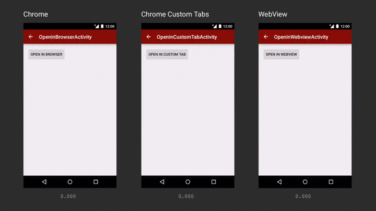

## Using Chrome Custom Tabs
> 原文链接：[Chrome Custom Tabs](https://developer.chrome.com/multidevice/android/customtabs#bestpractices)

附上一张官方介绍图


Chrome Custom Tabs 支持可自定义的:

- Toolbar 的颜色
- 进入和退出的动画
- 在 toolbar 和 menu 中添加自定义的动作
- 预加载内容和预打开 chrome 以达到更快地加载

## When should I use Chrome Custom Tabs vs WebView?
以下是选择 Chrome Custom Tabs 的原因:

- 实现简单，不用考虑处理请求，权限或是 cookie 的存储
- 自定义 UI:
  - Toolbar 颜色
  - Action 按钮
  - 自定义 menu 选项
  - 自定义进/出动画
- Navigation awareness: the browser delivers a callback to the
application upon an external navigation.
- 性能优化:
  - Pre-warning of the Browser in the background, while avoiding
  stealing resources from the application.
  - 将相似的 URL 提前提供给浏览器，从而就快加载速度
- 生命周期管理：the browser prevents the application from being evicted
by the system while on top of it, by raising its importance to the
"foreground" level.
- 分享 cookie 集合和权限模型，所以用户不需要重新登陆已经链接上的网站，或重复
授权。
- 如果用户启用 Data Saver，那么他们依然不会受影响
- 支持多设备的同步自动表单数据填充
- 简单的自定义模型
- 能快速切回到 APP 中
- 如果你体验最新的浏览器体验

## When will this be available?

Chrome 45 可以支持所有 Chrome 用户。

## Implementation guide

比较复杂的例子：[Github 链接](https://github.com/GoogleChrome/custom-tabs-client)。这个例子
包含可重用的类（自定义 UI ，链接后台服务以及处理了生命周期和相应的 Activity ），

第一步，添加 extras 到 ACTION_VIEW intent 发送到 Chrome；第二步，链接由 Chrome
输出的 service

### Enable Chrome Custom Tabs

```java
String url = "http://guang2.github.io/";
Intent intent = new Intent(Intent.ACTION_VIEW, Uri.parse(url));
/* Its value is an IBinder passed
*  whilst creating a new session. See newSession() below.
*  必须要将 Extra 和 SESSION 相匹配。要是这个 service 没有用到并且没有有效的 session id
*  那么这个 Extra 也必须展现一个空白的 Tab
*/
private static final String EXTRA_CUSTOM_TABS_SESSION = "android.support.customtabs.extra.SESSION";
Bundle extras = new Bundle;
extras.putBinder(EXTRA_CUSTOM_TABS_SESSION,
    /* Set to null for no session */
    sessionICustomTabsCallback.asBinder());
intent.putExtras(extras);
```

### What happens if the user doesn't have a recent version of Chrome installed?
如果用户没有安装 Chrome 也没关系，依然能采用默认的浏览器处理请求

### Configure the color of tha address bar
只需传入一个 Color 的值就可以了

```java
private static final String EXTRA_CUSTOM_TABS_TOOLBAR_COLOR = "android.support.customtabs.extra.TOOLBAR_COLOR";
intent.putExtra(EXTRA_CUSTOM_TABS_TOOLBAR_COLOR, colorInt);
```

### Configure a custom action button
在地址栏上添加一个按钮，这个按钮实际上为一个包含相应动作请求的按钮图案的 Bundle
图标高 24 dp，宽 24-48 dp。
```java
// 使用 Bitmap 作为按钮图像资源。
private static final String KEY_CUSTOM_TABS_ICON =
    "android.support.customtabs.customaction.ICON";

/* 当按键触发时. Chrome 将会响应 PendingIntent#send()，将 url 作为数据。
* 另一方面，APP 通过 Intent#getDataString() 获取 url
*/
public static final String KEY_CUSTOM_TABS_PENDING_INTENT =
    "android.support.customtabs.customaction.PENDING_INTENT";

// 可选项. 使用一个 bundle 作为 parameters 如果一个 action button 是 specified.
public static final String EXTRA_CUSTOM_TABS_ACTION_BUTTON_BUNDLE =
    "android.support.customtabs.extra.ACTION_BUNDLE_BUTTON";
Bundle actionButtonBundle = new Bundle();
actionButtonBundle.putParcelable(KEY_CUSTOM_TABS_ICON, icon);
actionButtonBundle.putParcelable(KEY_CUSTOM_TABS_PENDING_INTENT, pendingIntent);
intent.putExtra(EXTRA_CUSTOM_TABS_ACTION_BUTTON_BUNDLE, actionButtonBundle);
```

### Configure a custom menu
menu 可以视为一个存储 Bundles 的数组
```java
public static final String KEY_CUSTOM_TABS_MENU_TITLE = "android.support.customtabs.customaction.MENU_ITEM_TITLE";

// 如果要添加的 item 比较多，可以使用一个 ArrayList
public static final String EXTRA_CUSTOM_TABS_MENU_ITEMS = "android.support.customtabs.extra.MENU_ITEMS";
ArrayList menuItemBundleList = new ArrayList<>();

// 对于每个 menu item 都要这么处理:
Bundle menuItem = new Bundle();
menuItem.putString(KEY_CUSTOM_TABS_MENU_TITLE, menuItemTitle);
menuItem.putParcelable(KEY_CUSTOM_TABS_PENDING_INTENT, pendingIntent);

menuItemBundleList.add(menuItem);

intent.putParcelableArrayList(EXTRA_CUSTOM_TABS_MENU_ITEMS, menuItemBundleList);
```

### Configure custom enter and exit animations
//TODO
```java
// Optional. Bundle constructed out of
ActivityOptions that Chrome will be running when
// it finishes CustomTabActivity. If you start the Custom Tab with
// a customized animation, you can specify a matching animation when Custom Tab
// returns to your app.

public static final String EXTRA_CUSTOM_TABS_EXIT_ANIMATION_BUNDLE =
"android.support.customtabs.extra.EXIT_ANIMATION_BUNDLE";
Bundle finishBundle = ActivityOptions.makeCustomAnimation(context, R.anim.clientEnterAnimResId, R.anim.CustomTabExitAnimResId).toBundle;
intent.putExtra(EXTRA_CUSTOM_TABS_EXIT_ANIMATION_BUNDLE, finishBundle);
Bundle startBundle = ActivityOptions.makeCustomAnimation(context, R.anim.CustomTabEnterAnimResId, R.anim.clientExitAnimResId).toBundle;
startActivity(intent, startBundle);
```

### Warm up Chrome to make pages load faster
预加载涉及到以下几项：

- 主机的 DNS 查找
- 大部分类似资源的 DNS 查找
- 通过 HTTPS/TLS 链接它

相应的步骤：

- 链接 service
- 链接上浏览的回调函数使用 `finishSetup` 方法，从而了解页面也就加载完。
- 在 service，调用 `warmup` 后台启动 chrome
- 创建一个 `newSesion`，这个 session 将用于对于 API 的所有的请求
- 使用 `mayLaunchUrl` 告诉 chrome 那个页面很可能将会加载
- 启动 VIEW Itent 使用 session ID

### Connect to the Chrome Service
以下通过 AIDL 创建接口并将创建一个代理类

```java
/*  针对不同的版本选择相应的 Package name
  * Stable = com.android.chrome
  * Beta = com.chrome.beta
  * Dev = com.chrome.dev
*/
public static final String CUSTOM_TAB_PACKAGE_NAME = "com.chrome.dev";

// 添加一个 serviceIntent
public static final String ACTION_CUSTOM_TABS_CONNECTION =
       "android.support.customtabs.action.CustomTabsService";
Intent serviceIntent = new Intent(ACTION_CUSTOM_TABS_CONNECTION);

serviceIntent.setPackage(CUSTOM_TAB_PACKAGE_NAME);
context.bindService(serviceIntent, mServiceConnection,
        Context.BIND_AUTO_CREATE | Context.BIND_WAIVE_PRIORITY);
```

|用途|方法|说明|
|---|---|---|
|Warm up the Browser Process|boolean warmup(long flags)|返回请求是否被接受|
|Create a new tab session|boolean newSession(ICustomTabsCallback callback)|返回是否创建成功|
|Tell Chrome what URL's the user is likely to open|boolean mayLaunchUrl(ICustomTabsCallback sessionCallback, Uri url, Bundle extras,List otherLikelyBundles)|啊|

// TODO
### Custom Tabs Connection Callback
void onNavigationEvent(int navigationEvent, Bundle extras)

```java
/**
* Sent when the tab has started loading a page.
*/
public static final int NAVIGATION_STARTED = 1;

/**
* Sent when the tab has finished loading a page.
*/
public static final int NAVIGATION_FINISHED = 2;

/**
* Sent when the tab couldn't finish loading due to a failure.
*/
public static final int NAVIGATION_FAILED = 3;

/**
* Sent when loading was aborted by a user action before it finishes like clicking on a link
* or refreshing the page.
*/
public static final int NAVIGATION_ABORTED = 4;

/**
* Sent when the tab becomes visible.
*/
public static final int TAB_SHOWN = 5;

/**
* Sent when the tab becomes hidden.
*/
public static final int TAB_HIDDEN = 6;
```

## 正片部分
看了这么多，终于讲到正片部分

### Connect to the Custom Tabs service and call warmup()
通过链接 Chrome 的 service 和预加载，每次打开一个链接都可以节省 700 ms

在你打算启动 chrome Tab 的 Activity 里的 `onStart` 里链接 Service。并且调用 `warmup`
这个加载属于低优先级，所以不会造成太大的影响，但能极大地提高打开链接的速度

### Pre-render content
如果你有超过 50% 的把握，用户会点击某个链接，那么就用 `mayLaunchUrl` 方法

调用 `mayLaunchUrl` 将会极大的加快打开速度，但也可能不产生额外的流量和电量
消耗，另外，对于设备出于低电量、较差的网络下，Custom Tabs 会设别出来并处理。

### Provide a fallback for when Custom Tabs is not installed
虽然对于大多数用户能使用 Custom Tabs，但还是需要考虑不支持的情况。对于不支持的
情况需要调用用户设备的默认浏览器来处理请求

### Add custom animations
```java
//Setting custom enter/exit animations
CustomTabsIntent.Builder intentBuilder = new CustomTabsIntent.Builder();
intentBuilder.setStartAnimations(this, R.anim.slide_in_right, R.anim.slide_out_left);
intentBuilder.setExitAnimations(this, android.R.anim.slide_in_left,
    android.R.anim.slide_out_right);

//Open the Custom Tab        
intentBuilder.build().launchUrl(context, Uri.parse("http://guang2.github.io"));
```

### Choosing an icon for the Action Button
在地址栏中添加按钮，可以使用一个 bitmap 并用 text 描述它。
注意：bitmap 大小要控制在 24dp 高，48dp 宽。

```java
String shareLabel = getString(R.string.label_action_share);
Bitmap icon = BitmapFactory.decodeResource(getResources(),
        android.R.drawable.ic_menu_share);

//Create a PendingIntent to your BroadCastReceiver implementation
Intent actionIntent = new Intent(
        this.getApplicationContext(), ShareBroadcastReceiver.class);
PendingIntent pendingIntent =
        PendingIntent.getBroadcast(getApplicationContext(), 0, actionIntent, 0);	        

//Set the pendingIntent as the action to be performed when the button is clicked.            
intentBuilder.setActionButton(icon, shareLabel, pendingIntent);
```

### Preparing for other browsers
// TODO
```java
/**
  * Returns a list of packages that support Custom Tabs.
  */
public static ArrayList getCustomTabsPackages(Context context) {
    PackageManager pm = context.getPackageManager();
    // Get default VIEW intent handler.
    Intent activityIntent = new Intent(Intent.ACTION_VIEW, Uri.parse("http://guang2.github.io"));

    // Get all apps that can handle VIEW intents.
    List resolvedActivityList = pm.queryIntentActivities(activityIntent, 0);
    ArrayList packagesSupportingCustomTabs = new ArrayList<>();
    for (ResolveInfo info : resolvedActivityList) {
        Intent serviceIntent = new Intent();
        serviceIntent.setAction(ACTION_CUSTOM_TABS_CONNECTION);
        serviceIntent.setPackage(info.activityInfo.packageName);
        // Check if this package also resolves the Custom Tabs service.
        if (pm.resolveService(serviceIntent, 0) != null) {
            packagesSupportingCustomTabs.add(info);
        }
    }
    return packagesSupportingCustomTabs;
}
```

### Allow the user to opt out of Custom Tabs
添加一个选项：使用默认浏览器打开链接

### Let native applications to handle the content
在打开网页前检查本地有没有相应的 APP 可以处理

### Customize the toolbar color
改变顶部通知栏的颜色，达到沉浸的效果

```java
//Setting a custom toolbar color
CustomTabsIntent.Builder intentBuilder = new CustomTabsIntent.Builder();
intentBuilder.setToolbarColor(Color.BLUE);
```

### Add a Share Action
默认是没有分享菜单的，所以要自己考虑添加
```java
//Sharing content from CustomTabs with on a BroadcastReceiver
public void onReceive(Context context, Intent intent) {
    String url = intent.getDataString();

    if (url != null) {
        Intent shareIntent = new Intent(Intent.ACTION_SEND);
        shareIntent.setType("text/plain");
        shareIntent.putExtra(Intent.EXTRA_TEXT, url);

        Intent chooserIntent = Intent.createChooser(shareIntent, "Share url");
        chooserIntent.setFlags(Intent.FLAG_ACTIVITY_NEW_TASK);

        context.startActivity(chooserIntent);
    }
}
```

### Customize the close button
默认是"X"键，可以自定义为”<-“

```java
CustomTabsIntent.Builder intentBuilder = new CustomTabsIntent.Builder();
intentBuilder.setCloseButtonIcon(BitmapFactory.decodeResource(
        getResources(), R.drawable.ic_arrow_back));
```

### Handle internal links
处理打开页面里的链接

```java
WebView webView = (WebView)findViewById(R.id.webview);
webView.setWebViewClient(new WebViewClient() {
    @Override
    public boolean shouldOverrideUrlLoading(WebView view, String url) {
        return true;
    }

    @Override
    public void onLoadResource(WebView view, String url) {
        if (url.startsWith("http://guang2.github.io")) {
            //Handle Internal Link...
        } else {
            //Open Link in a Custo Tab
            Uri uri = Uri.parse(url);
            CustomTabsIntent.Builder intentBuilder =
                    new CustomTabsIntent.Builder(mCustomTabActivityHelper.getSession());
           //Open the Custom Tab        
            intentBuilder.build().launchUrl(context, url));                            
        }
    }
});
```

### Handle multiple clicks
用户可能连续点击了多个链接，需要确保设置了100 ms 的延迟。
